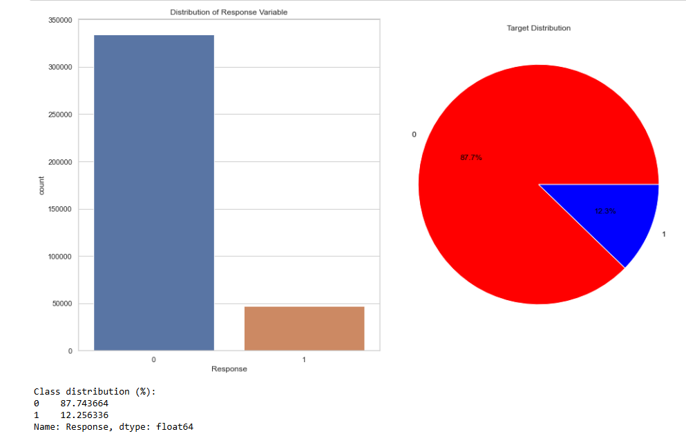
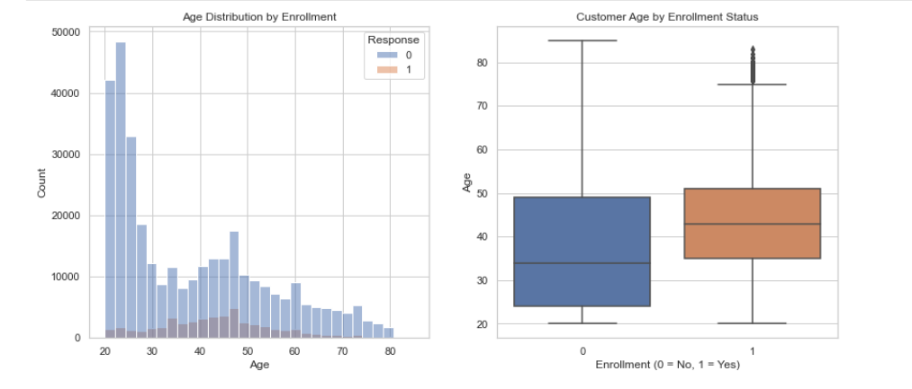
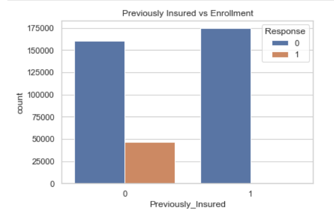
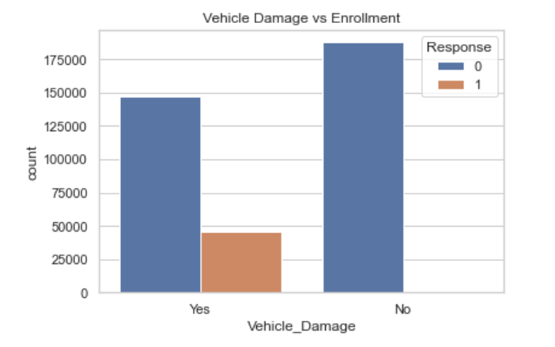
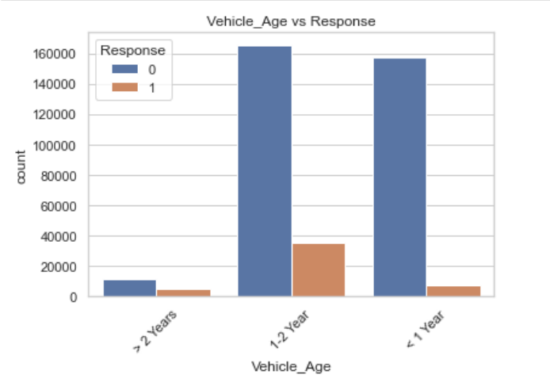

# Project Title — Health Insurance Cross-Sell Prediction Project
AUTHOR. [Jennifer Mbugua](https://github.com/Jen-Shiko)

## Project Overview
This project is based on the Health Insurance Cross-Sell Prediction dataset obtained from Kaggle, originally released with predefined train (which we are using as our main dataset)and test files for a machine learning competition. The primary goal is to predict whether an existing customer will enroll in a health insurance product offered by the company.

## Business & Data Understanding
The company deals with Vehicle Insurance and has decided to expand and venture into health insurance. Marketing resources are limited, and contacting every customer is costly. The challenge is to identify customers who are most likely to enroll in the insurance product, thereby increasing conversion rates and reducing unnecessary outreach. 
### Stakeholders
- **Marketing Team**: Interested in identifying customers most likely to enroll so that campaigns can be targeted efficiently.
- **Sales Team**: Needs a prioritized list of customers to optimize outreach efforts.
- **Business Leadership**: Interested in improving conversion rates while minimizing marketing costs.

### Objectives
- Analysis & Visualization
- Data Preparation
- Modeling
- Evaluation
- Findings
- Business Recommendations

#### Key Visualizations
##### Target Distribution

##### Age vs Enrollment

##### Previously Insured vs Enrollment

##### Vehicle Damage vs Enrollment

##### Vehicle Age vs Response

## Modeling

This project uses classification models to predict whether a customer is likely to enroll in a health insurance product.

Three models were developed and compared:

- **Logistic Regression**
  - Used as a baseline model due to its simplicity and interpretability
  - Helps explain how individual features influence enrollment likelihood

- **Decision Tree**
  - Captures non-linear relationships between customer attributes and enrollment
  - Provides intuitive decision rules

- **Random Forest**
  - An ensemble model combining multiple decision trees
  - Improves predictive performance and stability
  - Selected as the final model due to superior results

## Evaluation

The target variable is imbalanced, with relatively few customers enrolling in the health insurance product.  
Because of this, traditional accuracy was not sufficient for evaluation.

The following metrics were prioritized:

- **Recall**
  - Measures how well the model identifies customers who actually enroll
  - Important to avoid missing potential customers

- **F1-score**
  - Balances recall and precision
  - Ensures the model does not generate excessive false positives

Among all models, the **Random Forest model achieved the best balance between recall and F1-score**, making it the most effective choice for business deployment.

Performance remained stable when evaluated on the unseen Kaggle validation dataset, indicating strong generalization ability.

## Conclusion
This project demonstrates how machine learning can support targeted marketing strategies in the insurance industry.

Findings:
- Customer enrollment is rare, making targeted outreach essential
- Prior insurance status, vehicle damage history, and age are strong predictors
- Ensemble models outperform simpler baselines in identifying high-potential customers

#### Business Recommendations
1. Deploy the Model for Targeted Marketing Campaigns
    - Use the Random Forest model to prioritize customers with a higher predicted probability of enrollment.
    - Business Impact: Reduced marketing costs, higher conversion rates and more efficient use of sales resources

2. Focus Campaigns on High-Value Customer Segments
    - Prioritize outreach to: Customers without prior insurance, with a history of vehicle damage and belonging in younger and middle-aged demographics
    - Business Impact: Improves campaign effectiveness by aligning messaging with customer needs.

3. Use Probabilities to Control Marketing Spend
    - Instead of a fixed yes/no decision, use predicted probabilities to:
        - Set thresholds for outreach
        - Adjust campaign intensity based on confidence levels
    - Business Impact: Allows flexible, data-driven decision-making and budget control.

4. Integrate Model Insights into CRM Systems
    - Incorporate model outputs into existing CRM tools to:
        - Rank customers
        - Support sales team decision-making
        - Enable real-time targeting
    - Business Impact: Improves operational efficiency and sales productivity.

5. Continuously Monitor and Retrain the Model
    - Customer behavior may change over time due to:
        - Market conditions
        - Policy changes
        - Economic factors
    - Recommendation: Regularly retrain the model with updated data to maintain performance.

## Appendix
[📄 Insurance Prediction Presentation Slides (PDF)](.pdf)
[📄 HICSP Analysis Notebook](index.ipynb)
[📄 HICSP Analysis Notebook(PDF)](project_notebook.pdf)
